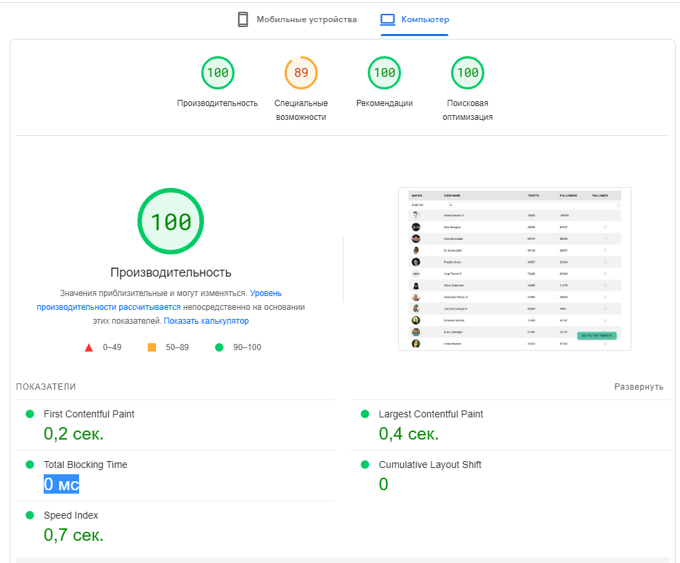

# GoIT pet-project

## Utils stack

[react, router-dom, react-dropdown, store, mobx, styled-components, mokapi]

## The following performance metrics were achieved for the website:

- First Contentful Paint (FCP): 0,2 seconds
- Largest Contentful Paint (LCP): 0,4 seconds
- Total Blocking Time (TBT): 0 ms
- Cumulative Layout Shift (CLS): 0

These metrics were obtained using
[Google PageSpeed Insights](https://pagespeed.web.dev/) .

